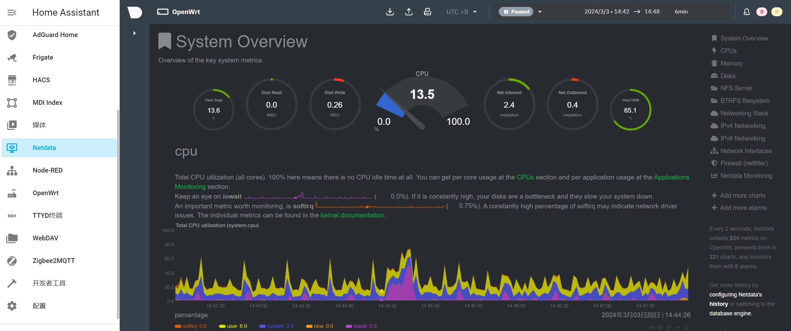
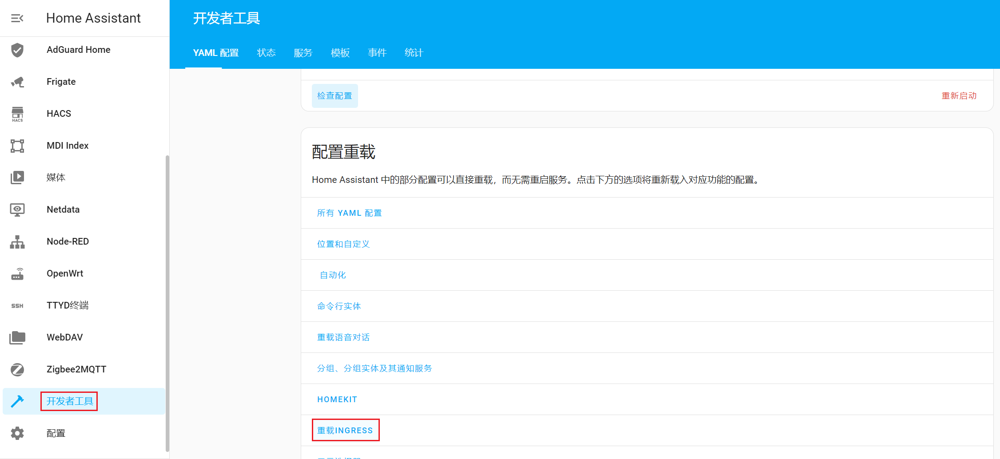
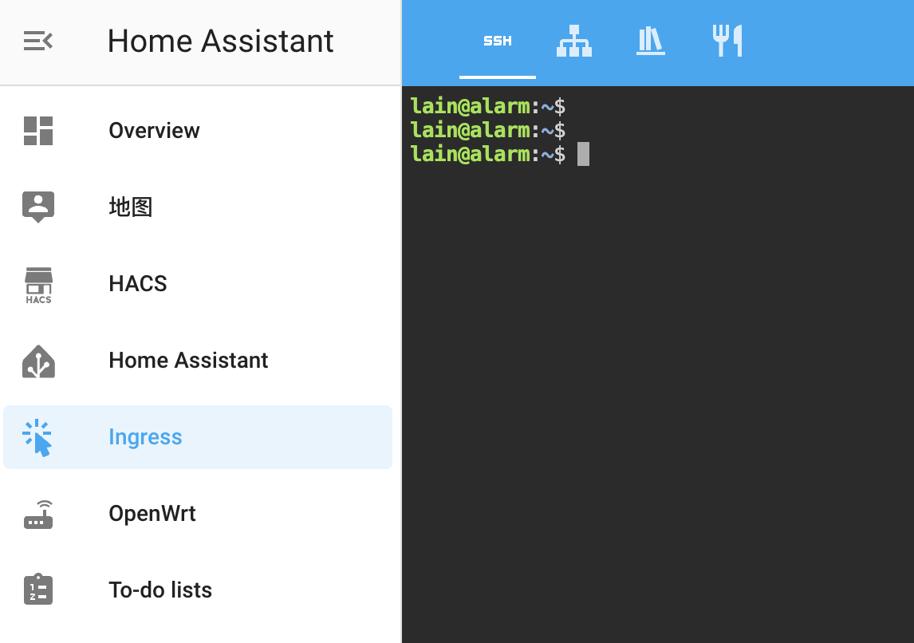

# hass_ingress


**💡 Tip:** If this project helps you, consider giving me a tip for the time I spent building this project:

<a href="https://www.buymeacoffee.com/lovelylain" target="_blank">
  
</a>

v1.2.4 Feature: [Multiple Tabs](#multiple-tabs) without reloading when switch tabs.

v1.2.5 Feature: [Static Token](#static-token) public links that never expire.

[Addons\(equivalent containers\) for Docker installation](addons-for-docker-installation.md)

Hass.io provides a very nice feature called [Hass.io Ingress](https://www.home-assistant.io/blog/2019/04/15/hassio-ingress/), `hass_ingress` extracts this feature into a standalone integration, it allows you to add additional ingress panels to your Home Assistant frontend. The panels are listed in the sidebar and can contain external resources like the web frontend of your router, your monitoring system, or your media server. Home Assistant will take care of the authentication and the secure connection, so users can access the external resources without extra login.



## Features

- Ingress function similar to [Hass.io Ingress](https://www.home-assistant.io/blog/2019/04/15/hassio-ingress/). (option: `work_mode: ingress`)
- Sidebar function similar to [Webpage dashboard](https://www.home-assistant.io/dashboards/dashboards/#webpage-dashboard). (option: `work_mode: iframe`)
- Work with nginx auth_request for backend services can't be proxied by ingress. (option: `work_mode: auth`)
- Support hassio add-on ingress. (option: `work_mode: hassio` `url: addonSlug`)
- Add any HA page as a sidebar panel. (option: `ui_mode: replace`)
- Hide header on ingress panel pages. (option: `ui_mode: normal`)
- Show header on ingress panel pages. (option: `ui_mode: toolbar`)
- Hide ingress panels from sidebar. (option: `parent: parent_panel`)
- Additional http headers passed to the backend service, such as `authorization` and `host`, so that we can access the external resources without extra login. (option: `work_mode: ingress` `header: {map}`)
- Embed in other pages. (url: `/api/ingress/{name}/`)
- Passing url parameters. (url: `/{panel}?index={overwrite_index}`)
- Reload Ingress configuration without restarting HA.
- Toggle Home Assistant sidebar via swipe gestures(code from [hass-sidebar-swipe](https://github.com/breakthestatic/hass-sidebar-swipe)).
- Support custom view and switch between iframes without reloading.

## Installation

### HACS

Use this link to directly go to the repository in HACS

[](https://my.home-assistant.io/redirect/hacs_repository/?owner=lovelylain&repository=hass_ingress)

_or_

1. Install HACS if you don't have it already
1. Open HACS in Home Assistant
1. Add custom repository https://github.com/lovelylain/hass_ingress
1. Search for `Ingress` integration
1. Click the download button ⬇️

### Manual

1. Download the [latest release](https://github.com/lovelylain/hass_ingress/releases/latest) and unzip.
2. Put the `custom_components/ingress` folder into your `config/custom_components` folder.

## Configuration

To enable Ingress panels in your installation, add the following to your `configuration.yaml` file, then restart HA:

```yaml
ingress:
  link_automation:
    work_mode: iframe
    ui_mode: replace
    title: Automation
    icon: mdi:link
    url: /config/automation/dashboard
  frigate:
    ui_mode: toolbar
    title: Frigate
    icon: mdi:cctv
    url: http://172.30.32.2:5000
  nodered:
    require_admin: true
    title: Node-RED
    icon: mdi:sitemap
    url: http://127.0.0.1:45180
    headers:
      authorization: !secret nodered_auth
  nodered_ui:
    parent: nodered
    title: Node-RED Dashboard
    icon: mdi:monitor-dashboard
    url: http://127.0.0.1:45180
    index: /ui/
    headers:
      authorization: !secret nodered_auth
  openwrt:
    title: OpenWrt
    icon: mdi:router-wireless-settings
    url: http://192.168.0.1/
    headers:
      # auto login for openwrt ingress
      http-auth-user: !secret openwrt_user
      http-auth-pass: !secret openwrt_auth
    # "fix" absolute URLs by rewriting the response body
    rewrite:
      # for HTML response
      - mode: body
        match: /(luci-static|cgi-bin)/
        replace: $http_x_ingress_path/\1/
      # for JS init code
      - mode: body
        match: \\/(luci-static|cgi-bin|ubus)\\/
        replace: $http_x_ingress_path\/\1\/
      # for login response
      - mode: header
        name: "(Location|Set-Cookie)"
        match: /cgi-bin/
        replace: $http_x_ingress_path/cgi-bin/
```

After you modify the Ingress configuration, you can go to `developer-tools` page and click `INGRESS` to reload without restarting HA.



## Configuration variables

- **ingress**: map (REQUIRED) Enables the hass_ingress integration. Only allowed once.
  - **panel_name**: map (REQUIRED) Name of the panel. Only allowed once.
    - **title**: string (REQUIRED) Friendly title for the panel. Will be used in the sidebar.
    - **icon**: [icon](https://www.home-assistant.io/docs/configuration/customizing-devices/#icon) (optional) Icon for entry.
    - **require_admin**: boolean (optional, default: false) If admin access is required to see this iframe.
    - **work_mode**: string (oneof `ingress` `subapp` `iframe` `auth` `hassio` `custom`, default: ingress)
      - ingress: Ingress function similar to [Hass.io Ingress](https://www.home-assistant.io/blog/2019/04/15/hassio-ingress/).
      - iframe: Sidebar function similar to [Webpage dashboard](https://www.home-assistant.io/dashboards/dashboards/#webpage-dashboard).
      - auth: Work with nginx auth_request for backend services can't be proxied by ingress.
        ```ini
        auth_request api: /api/ingress/_/auth
        request header: X-Ingress-Name(ingress_name), X-Original-URL($scheme://$http_host$request_uri), X-Hass-Origin(hass_url)
        response header: Set-Cookie(ingress_token) if succ, Location(login_url_path) if 401.
        ```
      - hassio: Support hassio add-on ingress, in this case set url with add-on slug, for example `url: a0d7b954_grafana`. This mode does not enable add-ons that do not support ingress to support ingress, it only provides some personalized functions for the ingress sidebar, such as customizing the sidebar title and hiding the header.
    - **ui_mode**: string (oneof `replace` `normal` `toolbar`, default: normal)
      - replace: Redirect to the target url, useful when adding an HA page as a sidebar panel.
      - normal: No header on ingress panel pages.
      - toolbar: Show header on ingress panel pages.
    - **url**: string (REQUIRED) The absolute URL or relative URL with an absolute path to open.
      If you want to use multiple front-end domains for `iframe` and `auth` mode, you can enable the extended configuration for the `url` option:
      ```yaml
      url:
        match: JS regular expression to match scheme://host[:port].
        replace: JS regular replacement to build real url.
        default: Default url when regular expression does not match.
      ```
      For example, you use http://hass.web.local to access HA from the internal network, and https://hass.example.com from the external, you want to use http://openwrt.web.local to access auth mode openwrt from the internal, and https://openwrt.example.com from the external. You can set `match: (\w+://)hass(\..+)`, `replace: $1openwrt$2`, `default: https://openwrt.example.com` to achieve your goal.
    - **index**: string (optional, default empty) The relative URL of index page. If the `url` is http://127.0.0.1:45180/ui/, all access must be under the /ui/ path; if the `url` is http://127.0.0.1:45180 and the `index` is /ui/, all paths of http://127.0.0.1:45180 can be accessed.
    - **parent**: string (optional, default empty) Parent ingress panel name. If non-empty, this panel will be hidden from the HA sidebar and you can access it via the `/{parent panel_name}/{child panel_name}` link. For example, the parent panel `nodered`, the sub-panel `ui` or `nodered_ui`, you can access the sub-panel through `/nodered/ui`.
    - **headers**: map (optional) Additional http headers passed to the backend service, such as `authorization` for `basic auth`.
    - **rewrite**: list (optional) List of response body/header rewrite rules:
      - **mode**: string (REQUIRED, oneof `body` `header`) Whether to rewrite response body or headers.
      - **path**: string (optional) URL prefix to apply this rule to, uses RegEx. E.g. `/.*` for everything.
      - **name**: string (optional, only with `header`) Header whole name to match, uses RegEx.
      - **match**: string (REQUIRED) RegEx pattern to search in body or header value.
      - **replace**: string (REQUIRED) Python Replacement for the matched RegEx, use `\1`, `\2` to reference capture groups. `$http_x_ingress_path` in this option will be replaced with `/api/ingress/{name}`.
    - **expire_time**: integer (optional, default: 3600) Hass ingress generates a token for each panel, which is used to access the panel. This option is used to specify the token validity period.
    - **cookie_name**: string (optional, default: ingress_token) Hass ingress uses cookies to pass tokens, if the cookie name conflicts with the backend service, you can use other value through this option.
    - **static_token**: string (optional, default empty) You provide the token instead of dynamically generating one, so you can obtain access links (`/api/ingress/t-{static_token}/`) that never expire. For example set static_token=`a-secret-token-value`, you can access the backend service without login HA through `/api/ingress/t-a-secret-token-value/`.
    - **disable_chunked**: boolean (optional, default: false) If the backend service does not support chunked encoding, you can disable chunked through this option.

_Notice: Not all backend services can be proxied by ingress, it must use relative paths or use `X-Ingress-Path` http header to generate correct absolute paths. For unsupported backend services, you can try `work_mode: auth` to work with another domain reverse proxied by nginx, or use nginx's sub_filter to fix the absolute paths in the response._

_Another option is to use body rewrite rules, see the OpenWrt example above._

## Multiple Tabs

With the following configuration, you can display web pages in multiple tabs without reloading the iframe when switching tabs.



```yaml
ingress:
  tabs:
    work_mode: custom # MUST
    url: /files/ingress/ha-tabs-ingress.js # MUST
    title: Ingress
    icon: mdi:cursor-default-click
  ttyd:
    parent: tabs
    work_mode: ingress
    title: Terminal
    url:
  nodered:
    parent: tabs
    work_mode: hassio
    title: Node-RED
    url:
```

You can directly visit tabs mode nodered through `/tabs/_/nodered`, or dashboard mode through `/tabs/nodered`.

## Static Token

With static token feature, you can access the backend service without login HA through `/api/ingress/t-{static_token}/`.

```yaml
ingress:
  ttyd: # you can access ttyd with /api/ingress/t-secret-token-value-for-ttyd/ without login.
    work_mode: ingress
    title: Terminal
    url:
    static_token: secret-token-value-for-ttyd
  nodered_webhook: # you can access ttyd with /api/ingress/t-secret-token-value-for-nodered_webhook/ without login.
    parent: nodered
    work_mode: ingress
    url:
    static_token: secret-token-value-for-nodered_webhook
```
